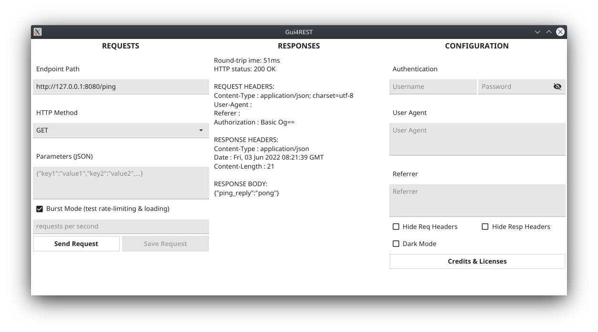

# Gui4REST
A no-bloat native GUI client for REST APIs

Back to the basics of what's essential in a REST API client:
- Light and light on its feet (~12 MB)
- Configurable yet stays out of your way
- Cross-platform: Windows, MacOS, Linux, BSD... all aboard!
- Light & dark theming
- Compiles to a single statically-linked executable: zero external dependencies
- Zero embedded phone-home elements


## Screenshots

| Dark Theme  | Light Theme |
| ------------- | ------------- |
|   |   |


## Installing & Running
Portable executable binaries for Windows, MacOS, Linux and BSD are available in the releases page.
You may choose to run Gui4REST directly by double-clicking on the downloaded file.
On Linux, if double-clicking does not fire it up, make it executable first by running these commands:
```
cd /path/to/Gui4REST
chmod +x Gui4REST
```
Supported architectures: amd64, arm, arm64, 386, riscv64


## TODO
- Burst Mode
- Saving & loading of previously run APIRequests
- Tests
